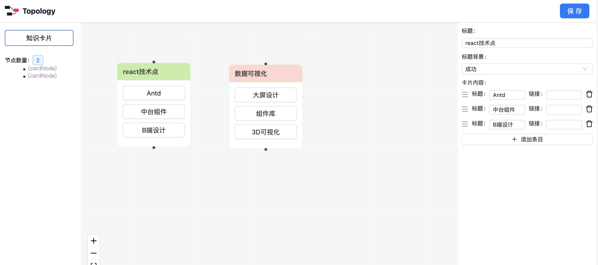

# react-topo 拓扑图可视化

react-topo 项目技术栈，更多基础配置参考 [Umi Max](https://next.umijs.org/zh-CN/docs/max/introduce)

* react v18
* antd v5
* umi v4
* pro-components
* reactflow



业务组件规范

1. 业务逻辑与数据分离，高阶组件
2. API支持可配置，可扩展，灵活性
3. 组件名称规范化，一看名称就知道组件的应用场景


### git操作

```bash
git clone https://github.com/lulongwen/react-topo.git

# 安装依赖
yarn install

# 运行项目
yarn dev
```


### 分支开发

```bash
# 本地创建分支并进入，分支拉取 master
git checkout -b feature/dev origin/master

# 拉取线上分支
git fetch

# 本地分支 'feature/dev' 关联线上线上分支'origin' 的远程分支 'feature/dev'
git branch --set-upstream-to=origin/feature/dev feature/dev

#本地远程关联
git branch --set-upstream-to=origin/master master

# 执行完 add 撤销
git reset .

# 执行完 commit 撤销
git reset HEAD # 后面什么都不跟的话 就是上一次add 里面的全部撤销
git reset HEAD # XXX/XX.js 对某个文件进行撤销
```


## 参与贡献

1.  Fork 本仓库
2.  新建 Feat_xxx 分支
3.  提交代码
4.  新建 Pull Request
